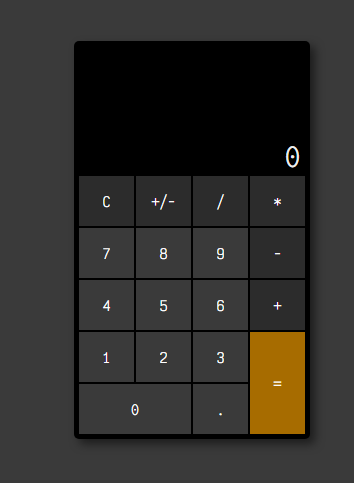

# Enkel Kalkylator

En enkel kalkylator som tillåter användaren att utföra grundläggande matematiska operationer. Detta projekt skapades som en del av ett skolprojekt för att demonstrera grundläggande kunskaper inom HTML, CSS och JavaScript.

## Screenshot

## Funktioner

- **Grundläggande beräkningar:** Addition, subtraktion, multiplikation och division.
- **Positivt/negativt:** Ändra tecknet på det aktuella talet.
- **Historik:** Se det inmatade matematiska uttrycket.
- **Nollställ:** Återställ både resultat och historik.
- **Felhantering:** Visar "Error" om det uppstår felaktiga beräkningar.

## Användning

1. Öppna `index.html` i din webbläsare.
2. Klicka på knapparna för att ange tal och utföra beräkningar.
3. Använd "C" för att nollställa och "=" för att få resultatet.

## Tekniker och verktyg

- HTML
- CSS
- JavaScript

## Utvecklare

- Louise Norrsén
